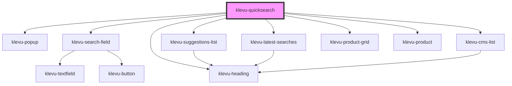

# klevu-quicksearch

<!-- Auto Generated Below -->

## Properties

| Property            | Attribute           | Description                                                                                                                                                                                                                                                                                                    | Type                                                                                                                                                                              | Default        |
| ------------------- | ------------------- | -------------------------------------------------------------------------------------------------------------------------------------------------------------------------------------------------------------------------------------------------------------------------------------------------------------- | --------------------------------------------------------------------------------------------------------------------------------------------------------------------------------- | -------------- |
| `fallbackTerm`      | `fallback-term`     | What term should be used if there isn't enough results                                                                                                                                                                                                                                                         | `string \| undefined`                                                                                                                                                             | `undefined`    |
| `popupAnchor`       | `popup-anchor`      | Anchor popup to witch side                                                                                                                                                                                                                                                                                     | `"bottom" \| "bottom-end" \| "bottom-start" \| "left" \| "left-end" \| "left-start" \| "right" \| "right-end" \| "right-start" \| "top" \| "top-end" \| "top-start" \| undefined` | `"bottom-end"` |
| `renderProductSlot` | --                  | Function to render custom products. Result has to be native HTML element or a string. Provides a product being rendered. This function is called for each slot (top, image, info and bottom) of the component. Second parameter provides slot requested. Return null for slots that you do not want to render. | `((product: KlevuRecord, productSlot: KlevuProductSlots) => string \| HTMLElement \| null) \| undefined`                                                                          | `undefined`    |
| `searchCategories`  | `search-categories` | Should component search for categories too                                                                                                                                                                                                                                                                     | `boolean \| undefined`                                                                                                                                                            | `undefined`    |
| `searchCmsPages`    | `search-cms-pages`  | Should component search for CMS pages too                                                                                                                                                                                                                                                                      | `boolean \| undefined`                                                                                                                                                            | `undefined`    |

## Slots

| Slot        | Description   |
| ----------- | ------------- |
| `"content"` | Popup content |

## Dependencies

### Depends on

- [klevu-popup](../klevu-popup)
- [klevu-search-field](../klevu-search-field)
- [klevu-suggestions-list](../klevu-suggestions-list)
- [klevu-latest-searches](../klevu-latest-searches)
- [klevu-cms-list](../klevu-cms-list)
- [klevu-heading](../klevu-heading)
- [klevu-product-grid](../klevu-product-grid)
- [klevu-product](../klevu-product)

### Graph

----------------------------------------------

*Built with [StencilJS](https://stenciljs.com/)*
