# klevu-quicksearch

<!-- Auto Generated Below -->

## Overview

Full app to create search bar that popups trending products and search results.

## Properties

| Property                      | Attribute                         | Description                                                                                                                                                                                                                                                                                                    | Type                                                                                                                                                                              | Default                                                     |
| ----------------------------- | --------------------------------- | -------------------------------------------------------------------------------------------------------------------------------------------------------------------------------------------------------------------------------------------------------------------------------------------------------------- | --------------------------------------------------------------------------------------------------------------------------------------------------------------------------------- | ----------------------------------------------------------- |
| `enableChat`                  | `enable-chat`                     | Enable Klevu MOI chat                                                                                                                                                                                                                                                                                          | `boolean \| undefined`                                                                                                                                                            | `undefined`                                                 |
| `fallbackTerm`                | `fallback-term`                   | What term should be used if there isn't enough results                                                                                                                                                                                                                                                         | `string \| undefined`                                                                                                                                                             | `undefined`                                                 |
| `fullResultCount`             | `full-result-count`               | How many products to show in full variant                                                                                                                                                                                                                                                                      | `number`                                                                                                                                                                          | `9`                                                         |
| `placeholder`                 | `placeholder`                     | Placeholder for input text                                                                                                                                                                                                                                                                                     | `string \| undefined`                                                                                                                                                             | `undefined`                                                 |
| `popupAnchor`                 | `popup-anchor`                    | Anchor popup to witch side                                                                                                                                                                                                                                                                                     | `"bottom" \| "bottom-end" \| "bottom-start" \| "left" \| "left-end" \| "left-start" \| "right" \| "right-end" \| "right-start" \| "top" \| "top-end" \| "top-start" \| undefined` | `"bottom-end"`                                              |
| `renderProductSlot`           | --                                | Function to render custom products. Result has to be native HTML element or a string. Provides a product being rendered. This function is called for each slot (top, image, info and bottom) of the component. Second parameter provides slot requested. Return null for slots that you do not want to render. | `((product: KlevuRecord, productSlot: KlevuProductSlots) => string \| HTMLElement \| null) \| undefined`                                                                          | `undefined`                                                 |
| `resultVariant`               | `result-variant`                  | Change variant of the search results                                                                                                                                                                                                                                                                           | `"full" \| "simple"`                                                                                                                                                              | `"simple"`                                                  |
| `searchCategories`            | `search-categories`               | Should component search for categories too                                                                                                                                                                                                                                                                     | `boolean \| undefined`                                                                                                                                                            | `undefined`                                                 |
| `searchCmsPages`              | `search-cms-pages`                | Should component search for CMS pages too                                                                                                                                                                                                                                                                      | `boolean \| undefined`                                                                                                                                                            | `undefined`                                                 |
| `searchFieldVariant`          | `search-field-variant`            | Change variant of the search field                                                                                                                                                                                                                                                                             | `"default" \| "pill"`                                                                                                                                                             | `"pill"`                                                    |
| `searchText`                  | `search-text`                     | Text of search button                                                                                                                                                                                                                                                                                          | `string \| undefined`                                                                                                                                                             | `undefined`                                                 |
| `simpleResultCount`           | `simple-result-count`             | How many products to show in simple variant                                                                                                                                                                                                                                                                    | `number`                                                                                                                                                                          | `3`                                                         |
| `tCategoriesCaption`          | `t-categories-caption`            | Title of categories section                                                                                                                                                                                                                                                                                    | `any`                                                                                                                                                                             | `getTranslation("quicksearch.tCategoriesCaption")`          |
| `tLastClickedProductsCaption` | `t-last-clicked-products-caption` | Recentely clicked tab caption                                                                                                                                                                                                                                                                                  | `any`                                                                                                                                                                             | `getTranslation("quicksearch.tLastClickedProductsCaption")` |
| `tSearchResults`              | `t-search-results`                | Title of search results                                                                                                                                                                                                                                                                                        | `any`                                                                                                                                                                             | `getTranslation("quicksearch.tSearchResults")`              |
| `tStartChat`                  | `t-start-chat`                    | Title of button to start Moi session                                                                                                                                                                                                                                                                           | `any`                                                                                                                                                                             | `getTranslation("quicksearch.tStartChat")`                  |
| `tTrendingCaption`            | `t-trending-caption`              | Trending tab caption                                                                                                                                                                                                                                                                                           | `any`                                                                                                                                                                             | `getTranslation("quicksearch.tTrendingCaption")`            |

## Slots

| Slot                      | Description                                |
| ------------------------- | ------------------------------------------ |
| `"content"`               | Popup content                              |
| `"last-clicked-products"` | Slot to replace last clicked products      |
| `"search-products"`       | Slot to replace search results listings    |
| `"trending-products"`     | Slot to replace trending products listings |

## Dependencies

### Depends on

- [klevu-util-viewport](../klevu-util-viewport)
- [klevu-popup](../klevu-popup)
- [klevu-search-field](../klevu-search-field)
- [klevu-moi](../klevu-moi)
- [klevu-suggestions-list](../klevu-suggestions-list)
- [klevu-cms-list](../klevu-cms-list)
- [klevu-typography](../klevu-typography)
- [klevu-sort](../klevu-sort)
- [klevu-product-grid](../klevu-product-grid)
- [klevu-product](../klevu-product)
- [klevu-pagination](../klevu-pagination)
- [klevu-button](../klevu-button)
- [klevu-popular-searches](../klevu-popular-searches)
- [klevu-latest-searches](../klevu-latest-searches)
- [klevu-tab](../klevu-tab)

### Graph

```mermaid
graph TD;
  klevu-quicksearch --> klevu-util-viewport
  klevu-quicksearch --> klevu-popup
  klevu-quicksearch --> klevu-search-field
  klevu-quicksearch --> klevu-moi
  klevu-quicksearch --> klevu-suggestions-list
  klevu-quicksearch --> klevu-cms-list
  klevu-quicksearch --> klevu-typography
  klevu-quicksearch --> klevu-sort
  klevu-quicksearch --> klevu-product-grid
  klevu-quicksearch --> klevu-product
  klevu-quicksearch --> klevu-pagination
  klevu-quicksearch --> klevu-button
  klevu-quicksearch --> klevu-popular-searches
  klevu-quicksearch --> klevu-latest-searches
  klevu-quicksearch --> klevu-tab
  klevu-search-field --> klevu-textfield
  klevu-search-field --> klevu-button
  klevu-textfield --> klevu-icon
  klevu-button --> klevu-icon
  klevu-button --> klevu-typography
  klevu-moi --> klevu-chat-layout
  klevu-moi --> klevu-typography
  klevu-moi --> klevu-button
  klevu-moi --> klevu-chat-messages
  klevu-moi --> klevu-loading-indicator
  klevu-moi --> klevu-modal
  klevu-moi --> klevu-product
  klevu-chat-layout --> klevu-util-scrollbars
  klevu-chat-layout --> klevu-popup
  klevu-chat-layout --> klevu-button
  klevu-chat-layout --> klevu-textfield
  klevu-chat-messages --> klevu-chat-bubble
  klevu-chat-messages --> klevu-icon
  klevu-chat-messages --> klevu-typography
  klevu-chat-messages --> klevu-button
  klevu-chat-messages --> klevu-slides
  klevu-chat-messages --> klevu-product
  klevu-chat-bubble --> klevu-typography
  klevu-chat-bubble --> klevu-icon
  klevu-chat-bubble --> klevu-button
  klevu-slides --> klevu-typography
  klevu-slides --> klevu-button
  klevu-slides --> klevu-util-scrollbars
  klevu-product --> klevu-icon
  klevu-product --> klevu-typography
  klevu-modal --> klevu-icon
  klevu-suggestions-list --> klevu-typography
  klevu-suggestions-list --> klevu-list
  klevu-list --> klevu-icon
  klevu-list --> klevu-typography
  klevu-cms-list --> klevu-typography
  klevu-cms-list --> klevu-list
  klevu-sort --> klevu-dropdown
  klevu-dropdown --> klevu-icon
  klevu-pagination --> klevu-icon
  klevu-popular-searches --> klevu-typography
  klevu-popular-searches --> klevu-list
  klevu-latest-searches --> klevu-typography
  klevu-latest-searches --> klevu-list
  klevu-tab --> klevu-typography
  style klevu-quicksearch fill:#f9f,stroke:#333,stroke-width:4px
```

---
