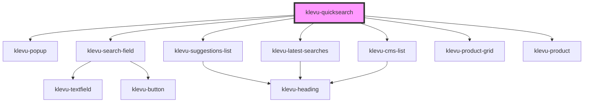

# klevu-quicksearch

<!-- Auto Generated Below -->

## Properties

| Property            | Attribute           | Description                                                                       | Type                                                                                             | Default     |
| ------------------- | ------------------- | --------------------------------------------------------------------------------- | ------------------------------------------------------------------------------------------------ | ----------- |
| `fallbackTerm`      | `fallback-term`     | What term should be used if there isn't enough results                            | `string \| undefined`                                                                            | `undefined` |
| `popupAnchor`       | `popup-anchor`      | Anchor popup to witch side                                                        | `"left" \| "right" \| undefined`                                                                 | `undefined` |
| `renderProductSlot` | --                  | Function render custom products. Result has to be native HTML element or a string | `((product: KlevuRecord, productSlot: KlevuProductSlots) => string \| HTMLElement) \| undefined` | `undefined` |
| `searchCategories`  | `search-categories` | Should component search for categories too                                        | `boolean \| undefined`                                                                           | `undefined` |
| `searchCmsPages`    | `search-cms-pages`  | Should component search for CMS pages too                                         | `boolean \| undefined`                                                                           | `undefined` |

## Dependencies

### Depends on

- [klevu-popup](../klevu-popup)
- [klevu-search-field](../klevu-search-field)
- [klevu-suggestions-list](../klevu-suggestions-list)
- [klevu-latest-searches](../klevu-latest-searches)
- [klevu-cms-list](../klevu-cms-list)
- [klevu-product-grid](../klevu-product-grid)
- [klevu-product](../klevu-product)

### Graph

----------------------------------------------

*Built with [StencilJS](https://stenciljs.com/)*
