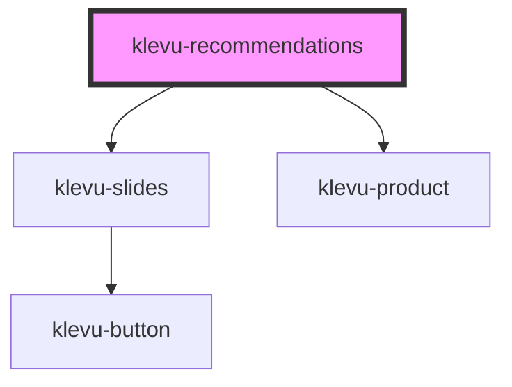

# klevu-recommendations

<!-- Auto Generated Below -->

## Overview

Full recommendation banner solution

## Properties

| Property                           | Attribute              | Description                                                                                                                                                                                                                                                                                       | Type                                                                                                     | Default     |
| ---------------------------------- | ---------------------- | ------------------------------------------------------------------------------------------------------------------------------------------------------------------------------------------------------------------------------------------------------------------------------------------------- | -------------------------------------------------------------------------------------------------------- | ----------- |
| `cartProductIds`                   | --                     | For cart recommendation you need to provide product id's in cart                                                                                                                                                                                                                                  | `string[] \| undefined`                                                                                  | `undefined` |
| `categoryPath`                     | `category-path`        | For category product recommendation you need to provide categery path                                                                                                                                                                                                                             | `string \| undefined`                                                                                    | `undefined` |
| `currentProductId`                 | `current-product-id`   | For similiar products recommendation you need to provide productId and itemGroupId                                                                                                                                                                                                                | `string \| undefined`                                                                                    | `undefined` |
| `itemGroupId`                      | `item-group-id`        | For similiar products recommendation you need to provide productId and itemGroupId                                                                                                                                                                                                                | `string \| undefined`                                                                                    | `undefined` |
| `recommendationId` _(required)_    | `recommendation-id`    | The ID of the recommendation                                                                                                                                                                                                                                                                      | `string`                                                                                                 | `undefined` |
| `recommendationTitle` _(required)_ | `recommendation-title` | Title of the recommendation                                                                                                                                                                                                                                                                       | `string`                                                                                                 | `undefined` |
| `renderProductSlot`                | --                     | Rendering function created to put custom content to klevu-product slots. Provides a product being rendered. This function is called for each slot (top, image, info and bottom) of the component. Second parameter provides slot requested. Return null for slots that you do not want to render. | `((product: KlevuRecord, productSlot: KlevuProductSlots) => string \| HTMLElement \| null) \| undefined` | `undefined` |

## Dependencies

### Depends on

- [klevu-slides](../klevu-slides)
- [klevu-product](../klevu-product)

### Graph

----------------------------------------------

*Built with [StencilJS](https://stenciljs.com/)*
