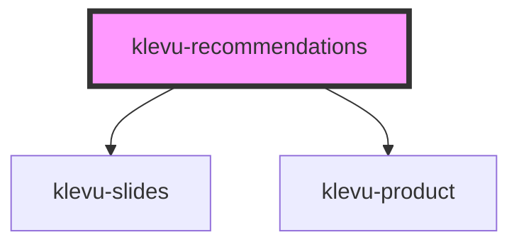

# klevu-recommendations

<!-- Auto Generated Below -->

## Properties

| Property                           | Attribute              | Description                                                                        | Type                    | Default     |
| ---------------------------------- | ---------------------- | ---------------------------------------------------------------------------------- | ----------------------- | ----------- |
| `cartProductIds`                   | --                     | For cart recommendation you need to provide product id's in cart                   | `string[] \| undefined` | `undefined` |
| `categoryPath`                     | `category-path`        | For category product recommendation you need to provide categery path              | `string \| undefined`   | `undefined` |
| `currentProductId`                 | `current-product-id`   | For similiar products recommendation you need to provide productId and itemGroupId | `string \| undefined`   | `undefined` |
| `itemGroupId`                      | `item-group-id`        | For similiar products recommendation you need to provide productId and itemGroupId | `string \| undefined`   | `undefined` |
| `recommendationId` _(required)_    | `recommendation-id`    | The ID of the recommendation                                                       | `string`                | `undefined` |
| `recommendationTitle` _(required)_ | `recommendation-title` | Title of the recommendation                                                        | `string`                | `undefined` |

## Dependencies

### Depends on

- [klevu-slides](../klevu-slides)
- [klevu-product](../klevu-product)

### Graph

----------------------------------------------

*Built with [StencilJS](https://stenciljs.com/)*
