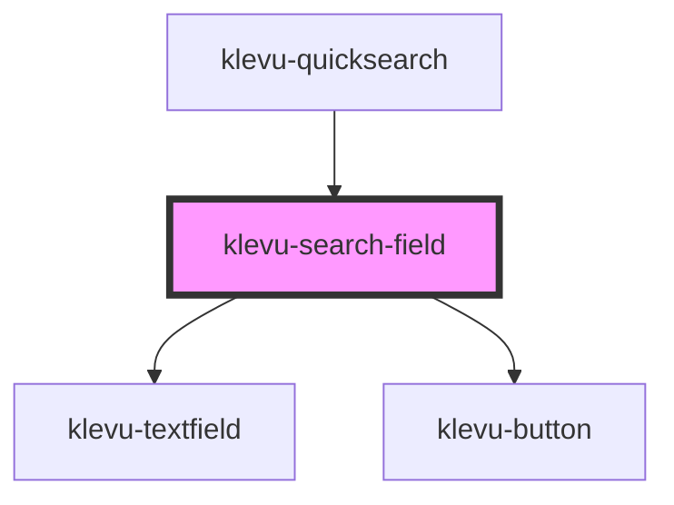

# klevu-search-field

<!-- Auto Generated Below -->

## Properties

| Property      | Attribute     | Description                                          | Type     | Default                 |
| ------------- | ------------- | ---------------------------------------------------- | -------- | ----------------------- |
| `limit`       | `limit`       |                                                      | `number` | `10`                    |
| `placeholder` | `placeholder` | The placeholder text to display in the search field. | `string` | `"Search for products"` |

## Events

| Event               | Description | Type                         |
| ------------------- | ----------- | ---------------------------- |
| `searchClick`       |             | `CustomEvent<string>`        |
| `searchResults`     |             | `CustomEvent<KlevuRecord[]>` |
| `searchSuggestions` |             | `CustomEvent<string[]>`      |

## Dependencies

### Used by

 - [klevu-quicksearch](../klevu-quicksearch)

### Depends on

- [klevu-textfield](../klevu-textfield)
- [klevu-button](../klevu-button)

### Graph

----------------------------------------------

*Built with [StencilJS](https://stenciljs.com/)*
