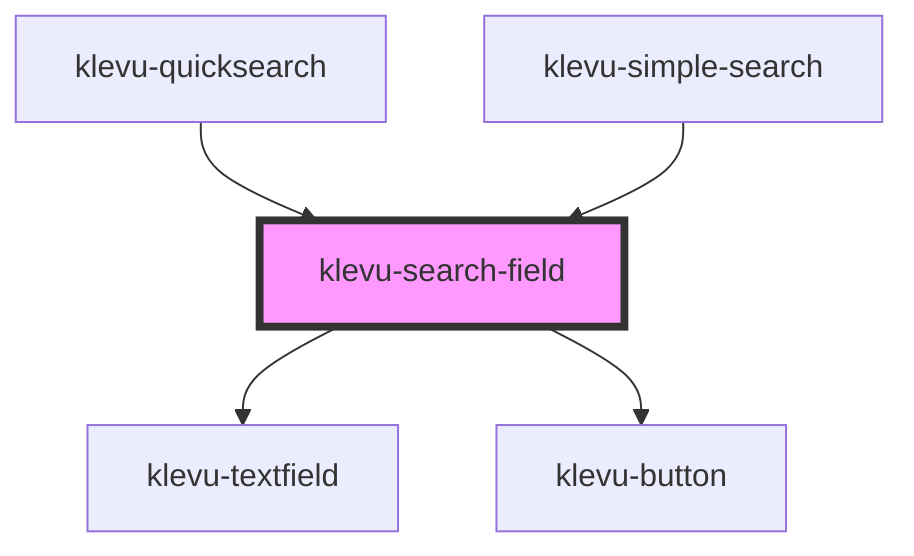

# klevu-search-field

<!-- Auto Generated Below -->

## Properties

| Property            | Attribute            | Description                                          | Type                   | Default                 |
| ------------------- | -------------------- | ---------------------------------------------------- | ---------------------- | ----------------------- |
| `fallbackTerm`      | `fallback-term`      | Fallback term to use if there are no results         | `string \| undefined`  | `undefined`             |
| `limit`             | `limit`              | Maximum amount of results                            | `number`               | `10`                    |
| `placeholder`       | `placeholder`        | The placeholder text to display in the search field. | `string`               | `"Search for products"` |
| `searchCategories`  | `search-categories`  | Should try to find categories as well                | `boolean \| undefined` | `undefined`             |
| `searchCmsPages`    | `search-cms-pages`   | Should try to find cms pages as well                 | `boolean \| undefined` | `undefined`             |
| `searchProducts`    | `search-products`    | Should search products                               | `boolean \| undefined` | `undefined`             |
| `searchSuggestions` | `search-suggestions` | Should search suggestions                            | `boolean \| undefined` | `undefined`             |

## Events

| Event                    | Description                                                                                             | Type                                                                                                                                                                                                    |
| ------------------------ | ------------------------------------------------------------------------------------------------------- | ------------------------------------------------------------------------------------------------------------------------------------------------------------------------------------------------------- |
| `klevuSearchClick`       | When user clicks search button. Returns the search term.                                                | `CustomEvent<string>`                                                                                                                                                                                   |
| `klevuSearchResults`     | When results come from after typing in the search field. This is debounced to avoid excessive requests. | `CustomEvent<{ fallback?: KlevuFetchQueryResult \| undefined; search?: KlevuFetchQueryResult \| undefined; category?: KlevuFetchQueryResult \| undefined; cms?: KlevuFetchQueryResult \| undefined; }>` |
| `klevuSearchSuggestions` | When searchfield gives some suggestions                                                                 | `CustomEvent<string[]>`                                                                                                                                                                                 |

## Dependencies

### Used by

 - [klevu-quicksearch](../klevu-quicksearch)
 - [klevu-simple-search](../klevu-simple-search)

### Depends on

- [klevu-textfield](../klevu-textfield)
- [klevu-button](../klevu-button)

### Graph

----------------------------------------------

*Built with [StencilJS](https://stenciljs.com/)*
