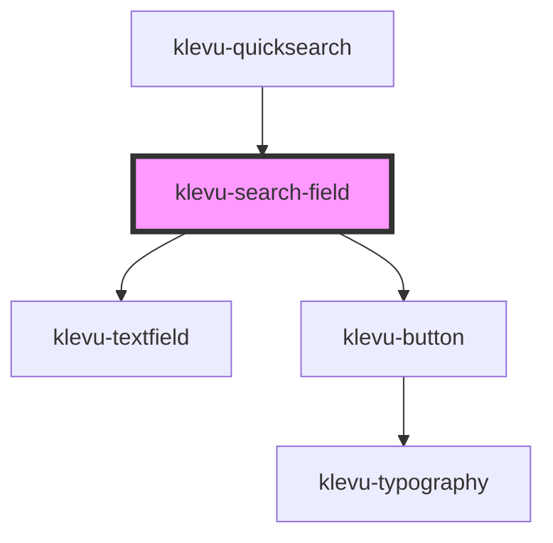

# klevu-search-field

<!-- Auto Generated Below -->

## Overview

Plain textfield that does the searching. It queries Klevu and returns the results
in a custom event. Then you can decide what to do with the results.

## Properties

| Property            | Attribute            | Description                                          | Type                                                                                                                                                                                                                                                                                                                                                    | Default                 |
| ------------------- | -------------------- | ---------------------------------------------------- | ------------------------------------------------------------------------------------------------------------------------------------------------------------------------------------------------------------------------------------------------------------------------------------------------------------------------------------------------------- | ----------------------- |
| `fallbackTerm`      | `fallback-term`      | Fallback term to use if there are no results         | `string \| undefined`                                                                                                                                                                                                                                                                                                                                   | `undefined`             |
| `limit`             | `limit`              | Maximum amount of results                            | `number`                                                                                                                                                                                                                                                                                                                                                | `10`                    |
| `placeholder`       | `placeholder`        | The placeholder text to display in the search field. | `string`                                                                                                                                                                                                                                                                                                                                                | `"Search for products"` |
| `searchCategories`  | `search-categories`  | Should try to find categories as well                | `boolean \| undefined`                                                                                                                                                                                                                                                                                                                                  | `undefined`             |
| `searchCmsPages`    | `search-cms-pages`   | Should try to find cms pages as well                 | `boolean \| undefined`                                                                                                                                                                                                                                                                                                                                  | `undefined`             |
| `searchProducts`    | `search-products`    | Should search products                               | `boolean \| undefined`                                                                                                                                                                                                                                                                                                                                  | `undefined`             |
| `searchSuggestions` | `search-suggestions` | Should search suggestions                            | `boolean \| undefined`                                                                                                                                                                                                                                                                                                                                  | `undefined`             |
| `searchText`        | `search-text`        | Button text                                          | `string`                                                                                                                                                                                                                                                                                                                                                | `"Search"`              |
| `sendAnalytics`     | `send-analytics`     | Sends analytics when making query                    | `boolean \| undefined`                                                                                                                                                                                                                                                                                                                                  | `undefined`             |
| `sort`              | `sort`               | In case you want to sort the results                 | `KlevuSearchSorting.AdvancedSorting \| KlevuSearchSorting.NameAsc \| KlevuSearchSorting.NameDesc \| KlevuSearchSorting.NewArrivalAsc \| KlevuSearchSorting.NewArrivalDesc \| KlevuSearchSorting.PriceAsc \| KlevuSearchSorting.PriceDesc \| KlevuSearchSorting.RatingAsc \| KlevuSearchSorting.RatingDesc \| KlevuSearchSorting.Relevance \| undefined` | `undefined`             |
| `variant`           | `variant`            | Variant of the search field                          | `"default" \| "pill"`                                                                                                                                                                                                                                                                                                                                   | `"default"`             |

## Events

| Event                    | Description                                                                                             | Type                                                                                                                                                                                                    |
| ------------------------ | ------------------------------------------------------------------------------------------------------- | ------------------------------------------------------------------------------------------------------------------------------------------------------------------------------------------------------- |
| `klevuSearchClick`       | When user clicks search button. Returns the search term.                                                | `CustomEvent<string>`                                                                                                                                                                                   |
| `klevuSearchResults`     | When results come from after typing in the search field. This is debounced to avoid excessive requests. | `CustomEvent<{ fallback?: KlevuFetchQueryResult \| undefined; search?: KlevuFetchQueryResult \| undefined; category?: KlevuFetchQueryResult \| undefined; cms?: KlevuFetchQueryResult \| undefined; }>` |
| `klevuSearchSuggestions` | When searchfield gives some suggestions                                                                 | `CustomEvent<string[]>`                                                                                                                                                                                 |

## Methods

### `getPage(type: "search" | "category" | "cms", pageIndex?: number) => Promise<void>`

Fetch next page of results from previous query

#### Returns

Type: `Promise<void>`

### `getQueryResult(type: "search" | "category" | "cms") => Promise<KlevuFetchQueryResult | undefined>`

Fetches query result from last request

#### Returns

Type: `Promise<KlevuFetchQueryResult | undefined>`

### `makeSearch(term: string) => Promise<void>`

Programmatically trigger search

#### Returns

Type: `Promise<void>`

## Dependencies

### Used by

 - [klevu-quicksearch](../klevu-quicksearch)

### Depends on

- [klevu-textfield](../klevu-textfield)
- [klevu-button](../klevu-button)

### Graph

----------------------------------------------

