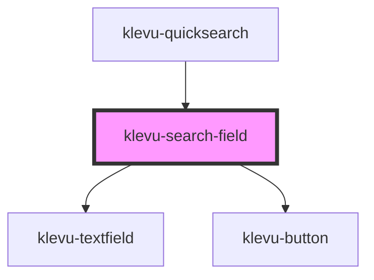

# klevu-search-field

<!-- Auto Generated Below -->

## Properties

| Property           | Attribute           | Description                                          | Type      | Default                 |
| ------------------ | ------------------- | ---------------------------------------------------- | --------- | ----------------------- |
| `fallbackTerm`     | `fallback-term`     | Fallback term to use if there are no results         | `any`     | `undefined`             |
| `limit`            | `limit`             | Maximum amount of results                            | `number`  | `10`                    |
| `placeholder`      | `placeholder`       | The placeholder text to display in the search field. | `string`  | `"Search for products"` |
| `searchCategories` | `search-categories` | Should try to find categories as well                | `boolean` | `undefined`             |
| `searchCmsPages`   | `search-cms-pages`  | Should try to find cms pages as well                 | `boolean` | `undefined`             |

## Events

| Event                    | Description                                                                                             | Type                                                                                                                                                |
| ------------------------ | ------------------------------------------------------------------------------------------------------- | --------------------------------------------------------------------------------------------------------------------------------------------------- |
| `klevuSearchClick`       | When user clicks search button. Returns the search term.                                                | `CustomEvent<string>`                                                                                                                               |
| `klevuSearchResults`     | When results come from after typing in the search field. This is debounced to avoid excessive requests. | `CustomEvent<{ fallback?: KlevuFetchQueryResult; search?: KlevuFetchQueryResult; category?: KlevuFetchQueryResult; cms?: KlevuFetchQueryResult; }>` |
| `klevuSearchSuggestions` |                                                                                                         | `CustomEvent<string[]>`                                                                                                                             |

## Dependencies

### Used by

 - [klevu-quicksearch](../klevu-quicksearch)

### Depends on

- [klevu-textfield](../klevu-textfield)
- [klevu-button](../klevu-button)

### Graph

----------------------------------------------

*Built with [StencilJS](https://stenciljs.com/)*
