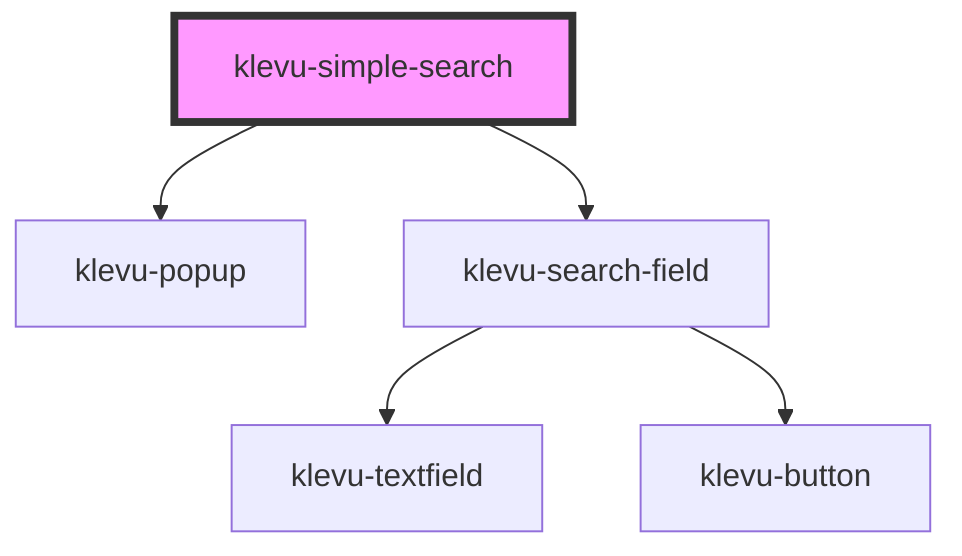

# klevu-simple-search

<!-- Auto Generated Below -->

## Overview

Simplified application that shows search box where typing text displays suggestions.

## Events

| Event                  | Description                              | Type                  |
| ---------------------- | ---------------------------------------- | --------------------- |
| `klevuSuggestionClick` | When any of suggestions has been clicked | `CustomEvent<string>` |

## Dependencies

### Depends on

- [klevu-popup](../klevu-popup)
- [klevu-search-field](../klevu-search-field)

### Graph

----------------------------------------------

*Built with [StencilJS](https://stenciljs.com/)*
