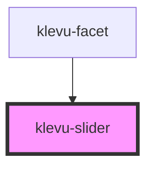

# klevu-slider

<!-- Auto Generated Below -->

## Overview

Horizontal slider component. Used for price range

## Properties

| Property           | Attribute       | Description                        | Type                                       | Default     |
| ------------------ | --------------- | ---------------------------------- | ------------------------------------------ | ----------- |
| `end`              | `end`           | Current end value of the range     | `number \| undefined`                      | `undefined` |
| `formatTooltip`    | --              | Format tooltip value with function | `((value: number) => string) \| undefined` | `undefined` |
| `max` _(required)_ | `max`           | Max value of the range             | `number`                                   | `undefined` |
| `min` _(required)_ | `min`           | Min value of the range             | `number`                                   | `undefined` |
| `showTooltips`     | `show-tooltips` | Show tooltips on top of slider     | `boolean \| undefined`                     | `undefined` |
| `start`            | `start`         | Current start value of the range   | `number \| undefined`                      | `undefined` |

## Events

| Event               | Description        | Type                            |
| ------------------- | ------------------ | ------------------------------- |
| `klevuSliderChange` | When values change | `CustomEvent<[number, number]>` |

## Dependencies

### Used by

 - [klevu-facet](../klevu-facet)

### Graph

----------------------------------------------

*Built with [StencilJS](https://stenciljs.com/)*
