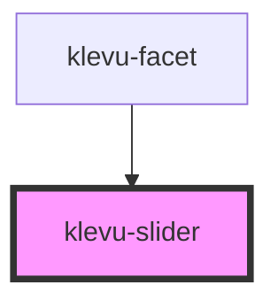

# klevu-slider

<!-- Auto Generated Below -->

## Properties

| Property           | Attribute       | Description | Type                   | Default     |
| ------------------ | --------------- | ----------- | ---------------------- | ----------- |
| `end`              | `end`           |             | `number \| undefined`  | `undefined` |
| `max` _(required)_ | `max`           |             | `number`               | `undefined` |
| `min` _(required)_ | `min`           |             | `number`               | `undefined` |
| `showTooltips`     | `show-tooltips` |             | `boolean \| undefined` | `undefined` |
| `start`            | `start`         |             | `number \| undefined`  | `undefined` |

## Events

| Event               | Description | Type                            |
| ------------------- | ----------- | ------------------------------- |
| `klevuSliderChange` |             | `CustomEvent<[number, number]>` |

## Dependencies

### Used by

 - [klevu-facet](../klevu-facet)

### Graph

----------------------------------------------

*Built with [StencilJS](https://stenciljs.com/)*
