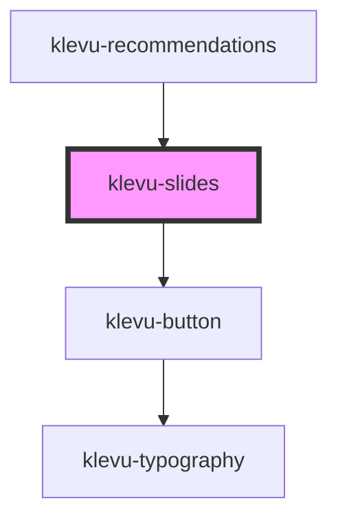

# klevu-slides

<!-- Auto Generated Below -->

## Overview

Horizontal slides component

## Properties

| Property         | Attribute          | Description                                                           | Type                   | Default     |
| ---------------- | ------------------ | --------------------------------------------------------------------- | ---------------------- | ----------- |
| `height`         | `height`           | Height of the slider                                                  | `number`               | `300`       |
| `hideNextPrev`   | `hide-next-prev`   | Hides next and previous buttons                                       | `boolean \| undefined` | `undefined` |
| `slideFullWidth` | `slide-full-width` | When clicking next/prev buttons should scroll full width of container | `boolean \| undefined` | `undefined` |

## Dependencies

### Used by

 - [klevu-recommendations](../klevu-recommendations)

### Depends on

- [klevu-button](../klevu-button)

### Graph

----------------------------------------------

*Built with [StencilJS](https://stenciljs.com/)*
