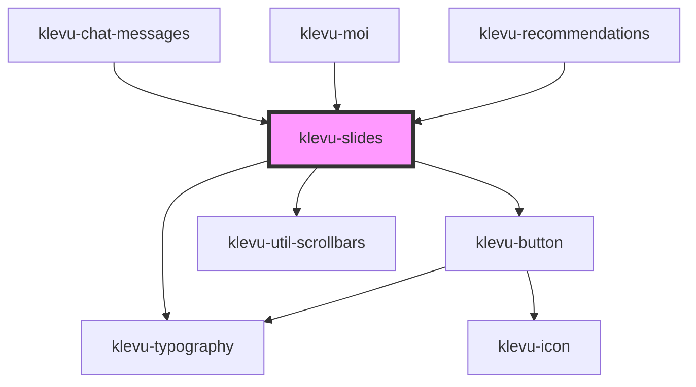

# klevu-slides

<!-- Auto Generated Below -->

## Overview

Horizontal slides component. Can be used to display a list of items horizontally. Has optional title and next/prev buttons.

## Properties

| Property         | Attribute          | Description                                                           | Type                   | Default     |
| ---------------- | ------------------ | --------------------------------------------------------------------- | ---------------------- | ----------- |
| `heading`        | `heading`          | Heading for the slides component                                      | `string \| undefined`  | `undefined` |
| `hideNextPrev`   | `hide-next-prev`   | Hides next and previous buttons                                       | `boolean \| undefined` | `undefined` |
| `slideFullWidth` | `slide-full-width` | When clicking next/prev buttons should scroll full width of container | `boolean \| undefined` | `undefined` |

## Dependencies

### Used by

 - [klevu-chat-messages](../klevu-chat-messages)
 - [klevu-moi](../klevu-moi)
 - [klevu-recommendations](../klevu-recommendations)

### Depends on

- [klevu-typography](../klevu-typography)
- [klevu-button](../klevu-button)
- [klevu-util-scrollbars](../klevu-util-scrollbars)

### Graph

----------------------------------------------

