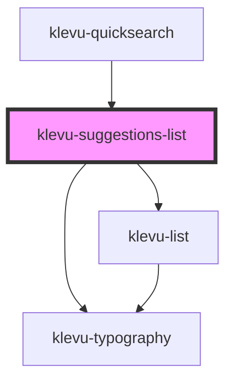

# klevu-suggestions-list

<!-- Auto Generated Below -->

## Overview

Simple component to list suggestions. Takes in a parameter suggestions that will be rendered as a list

## Properties

| Property      | Attribute | Description                   | Type       | Default                |
| ------------- | --------- | ----------------------------- | ---------- | ---------------------- |
| `caption`     | `caption` | Caption on the list           | `string`   | `"Search suggestions"` |
| `suggestions` | --        | Suggestions to render in list | `string[]` | `[]`                   |

## Dependencies

### Used by

 - [klevu-quicksearch](../klevu-quicksearch)

### Depends on

- [klevu-typography](../klevu-typography)
- [klevu-list](../klevu-list)

### Graph

----------------------------------------------

