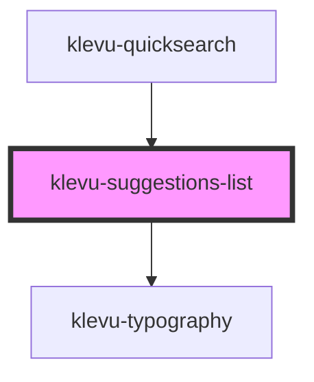

# klevu-suggestions-list

<!-- Auto Generated Below -->

## Overview

Simple component to list suggestions

## Properties

| Property                   | Attribute | Description                   | Type       | Default                |
| -------------------------- | --------- | ----------------------------- | ---------- | ---------------------- |
| `caption`                  | `caption` | Caption on the list           | `string`   | `"Search suggestions"` |
| `suggestions` _(required)_ | --        | Suggestions to render in list | `string[]` | `undefined`            |

## Shadow Parts

| Part           | Description |
| -------------- | ----------- |
| `"klevu-list"` |             |

## Dependencies

### Used by

 - [klevu-quicksearch](../klevu-quicksearch)

### Depends on

- [klevu-typography](../klevu-typography)

### Graph

----------------------------------------------

*Built with [StencilJS](https://stenciljs.com/)*
