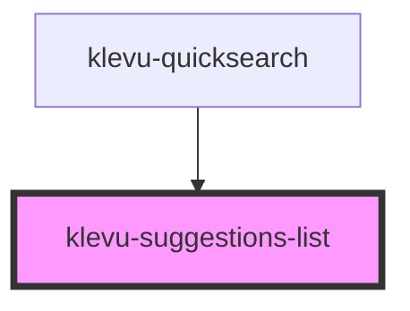

# klevu-suggestions-list

<!-- Auto Generated Below -->

## Properties

| Property      | Attribute | Description | Type       | Default                |
| ------------- | --------- | ----------- | ---------- | ---------------------- |
| `caption`     | `caption` |             | `string`   | `"Search suggestions"` |
| `suggestions` | --        |             | `string[]` | `undefined`            |

## Shadow Parts

| Part           | Description |
| -------------- | ----------- |
| `"klevu-list"` |             |

## Dependencies

### Used by

 - [klevu-quicksearch](../klevu-quicksearch)

### Graph

----------------------------------------------

*Built with [StencilJS](https://stenciljs.com/)*
