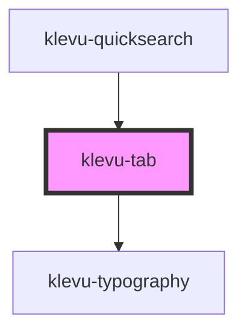

# klevu-tab

<!-- Auto Generated Below -->

## Overview

Very simple tab component. Use like a button, but with a caption.
Use standard onClick event to handle click.

## Properties

| Property               | Attribute  | Description                 | Type                   | Default     |
| ---------------------- | ---------- | --------------------------- | ---------------------- | ----------- |
| `active`               | `active`   | Whether the tab is active   | `boolean \| undefined` | `undefined` |
| `caption` _(required)_ | `caption`  | Title of the tab            | `string`               | `undefined` |
| `disabled`             | `disabled` | Whether the tab is disabled | `boolean \| undefined` | `undefined` |

## Dependencies

### Used by

 - [klevu-quicksearch](../klevu-quicksearch)

### Depends on

- [klevu-typography](../klevu-typography)

### Graph

----------------------------------------------

*Built with [StencilJS](https://stenciljs.com/)*
