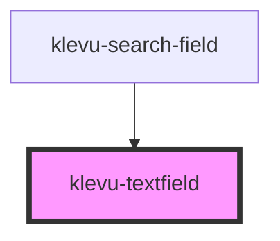

# klevu-textfield

<!-- Auto Generated Below -->

## Overview

Branded text field component

## Properties

| Property             | Attribute     | Description                    | Type                  | Default     |
| -------------------- | ------------- | ------------------------------ | --------------------- | ----------- |
| `disabled`           | `disabled`    | Is field disabled              | `boolean`             | `false`     |
| `placeholder`        | `placeholder` | Placeholder value of the field | `string \| undefined` | `undefined` |
| `value` _(required)_ | `value`       | Current value of the field     | `string`              | `undefined` |

## Events

| Event              | Description                | Type                  |
| ------------------ | -------------------------- | --------------------- |
| `klevuTextChanged` | When text changes in field | `CustomEvent<string>` |
| `klevuTextFocused` | When textfield is focused  | `CustomEvent<void>`   |

## Dependencies

### Used by

 - [klevu-search-field](../klevu-search-field)

### Graph

----------------------------------------------

*Built with [StencilJS](https://stenciljs.com/)*
