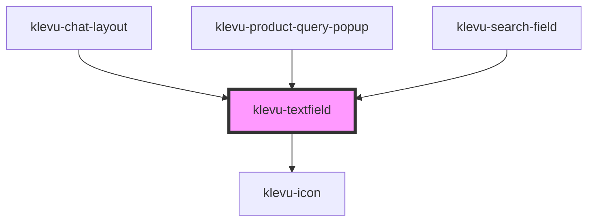

# klevu-textfield

<!-- Auto Generated Below -->

## Overview

Branded text field component

## Properties

| Property             | Attribute      | Description                                                                          | Type                   | Default     |
| -------------------- | -------------- | ------------------------------------------------------------------------------------ | ---------------------- | ----------- |
| `clearButton`        | `clear-button` | Display a button to clear field value on the right side of the field                 | `boolean \| undefined` | `undefined` |
| `disabled`           | `disabled`     | Is field disabled                                                                    | `boolean`              | `false`     |
| `error`              | `error`        | Is field in error state                                                              | `boolean \| undefined` | `undefined` |
| `icon`               | `icon`         | Icon to display in textfield start of the field. Please use tokens of material icons | `string \| undefined`  | `undefined` |
| `placeholder`        | `placeholder`  | Placeholder value of the field                                                       | `string \| undefined`  | `undefined` |
| `value` _(required)_ | `value`        | Current value of the field                                                           | `string`               | `undefined` |
| `variant`            | `variant`      | Variant of textfield                                                                 | `"default" \| "pill"`  | `"default"` |

## Events

| Event                   | Description                        | Type                  |
| ----------------------- | ---------------------------------- | --------------------- |
| `klevuTextChanged`      | When text changes in field         | `CustomEvent<string>` |
| `klevuTextEnterPressed` | When enter is pressed in textfield | `CustomEvent<void>`   |
| `klevuTextFocused`      | When textfield is focused          | `CustomEvent<void>`   |

## Dependencies

### Used by

 - [klevu-chat-layout](../klevu-chat-layout)
 - [klevu-product-query-popup](../klevu-product-query-popup)
 - [klevu-search-field](../klevu-search-field)

### Depends on

- [klevu-icon](../klevu-icon)

### Graph

----------------------------------------------

*Built with [StencilJS](https://stenciljs.com/)*
