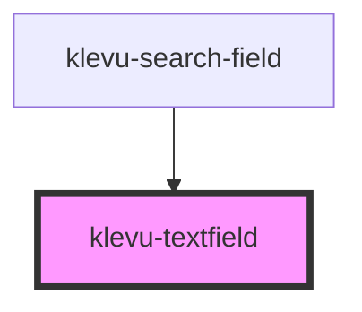

# klevu-textfield

<!-- Auto Generated Below -->

## Properties

| Property      | Attribute     | Description | Type      | Default     |
| ------------- | ------------- | ----------- | --------- | ----------- |
| `disabled`    | `disabled`    |             | `boolean` | `false`     |
| `placeholder` | `placeholder` |             | `string`  | `undefined` |
| `value`       | `value`       |             | `string`  | `undefined` |

## Events

| Event         | Description | Type                  |
| ------------- | ----------- | --------------------- |
| `textChanged` |             | `CustomEvent<string>` |
| `textFocused` |             | `CustomEvent<void>`   |

## Dependencies

### Used by

 - [klevu-search-field](../klevu-search-field)

### Graph

----------------------------------------------

*Built with [StencilJS](https://stenciljs.com/)*
