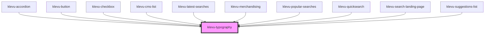

# klevu-heading

<!-- Auto Generated Below -->

## Overview

Heading element

## Properties

| Property               | Attribute | Description        | Type                                                                                                                                                 | Default     |
| ---------------------- | --------- | ------------------ | ---------------------------------------------------------------------------------------------------------------------------------------------------- | ----------- |
| `variant` _(required)_ | `variant` | Variant of heading | `"body-l" \| "body-l-bold" \| "body-m" \| "body-m-bold" \| "body-s" \| "body-s-bold" \| "body-xs" \| "body-xs-bold" \| "h1" \| "h2" \| "h3" \| "h4"` | `undefined` |

## Dependencies

### Used by

 - [klevu-accordion](../klevu-accordion)
 - [klevu-button](../klevu-button)
 - [klevu-checkbox](../klevu-checkbox)
 - [klevu-cms-list](../klevu-cms-list)
 - [klevu-latest-searches](../klevu-latest-searches)
 - [klevu-merchandising](../klevu-merchandising)
 - [klevu-popular-searches](../klevu-popular-searches)
 - [klevu-quicksearch](../klevu-quicksearch)
 - [klevu-search-landing-page](../klevu-search-landing-page)
 - [klevu-suggestions-list](../klevu-suggestions-list)

### Graph

----------------------------------------------

*Built with [StencilJS](https://stenciljs.com/)*
