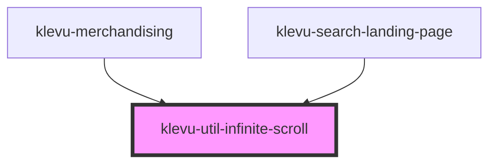

# klevu-infinite-scroll

<!-- Auto Generated Below -->

## Overview

Component that triggers event when intercepted on scroll of page.

## Properties

| Property                       | Attribute                         | Description                                                                                                                          | Type      | Default |
| ------------------------------ | --------------------------------- | ------------------------------------------------------------------------------------------------------------------------------------ | --------- | ------- |
| `enabled`                      | `enabled`                         | Whether infinite scrolling is enabled                                                                                                | `boolean` | `false` |
| `infiniteScrollPauseThreshold` | `infinite-scroll-pause-threshold` | The number of pages after which triggers infiniteScrollingPaused event. Listen to this event to allow further loading on user input. | `number`  | `3`     |

## Events

| Event                     | Description                                                                            | Type                |
| ------------------------- | -------------------------------------------------------------------------------------- | ------------------- |
| `infiniteScrollingPaused` | Event emitted when infinite loading reaches a multiple of infiniteScrollPauseThreshold | `CustomEvent<void>` |
| `loadMore`                | Event emitted when infinite scroll element is intercepted                              | `CustomEvent<void>` |

## Dependencies

### Used by

 - [klevu-merchandising](../klevu-merchandising)
 - [klevu-search-landing-page](../klevu-search-landing-page)

### Graph

----------------------------------------------

