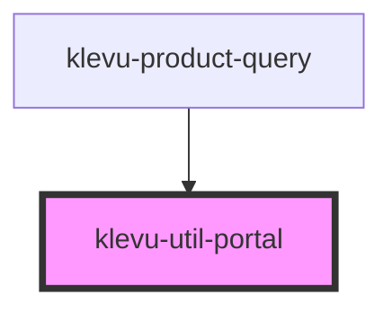

# klevu-util-portal

<!-- Auto Generated Below -->

## Overview

Portal component to move content to end of body instead of normal DOM position. Typically used for popups
to prevent problems with CSS stylings.

Does not move styles, so create a child component that has styles defined in shadow DOM.

## Dependencies

### Used by

 - [klevu-product-query](../klevu-product-query)

### Graph

----------------------------------------------

*Built with [StencilJS](https://stenciljs.com/)*
