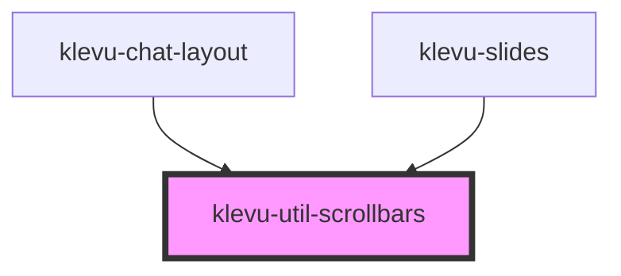

# klevu-util-scrollbars

<!-- Auto Generated Below -->

## Overview

Utility that replaces the default browser scrollbar with a custom one.

## Properties

| Property    | Attribute    | Description | Type                                                                                     | Default     |
| ----------- | ------------ | ----------- | ---------------------------------------------------------------------------------------- | ----------- |
| `overflowX` | `overflow-x` |             | `"hidden" \| "scroll" \| "visible" \| "visible-hidden" \| "visible-scroll" \| undefined` | `undefined` |
| `overflowY` | `overflow-y` |             | `"hidden" \| "scroll" \| "visible" \| "visible-hidden" \| "visible-scroll" \| undefined` | `undefined` |

## Methods

### `getContainer() => Promise<HTMLDivElement | undefined>`

#### Returns

Type: `Promise<HTMLDivElement | undefined>`

### `getInstance() => Promise<OverlayScrollbars | undefined>`

#### Returns

Type: `Promise<OverlayScrollbars | undefined>`

## Dependencies

### Used by

 - [klevu-chat-layout](../klevu-chat-layout)
 - [klevu-slides](../klevu-slides)

### Graph

----------------------------------------------

