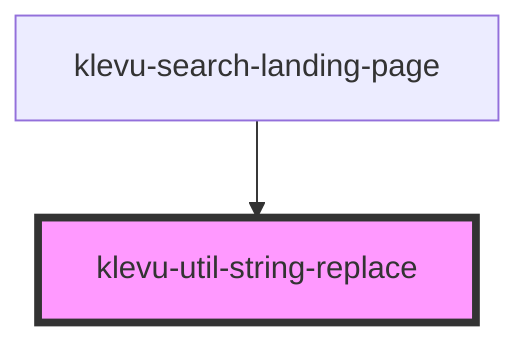

# klevu-util-string-replace

<!-- Auto Generated Below -->

## Overview

Can be used to replace string of values into the string marked with %s token.

string can contain multiple %s tokens. Each of them will be replace by the values array
corresponding index.

## Properties

| Property              | Attribute | Description                        | Type       | Default     |
| --------------------- | --------- | ---------------------------------- | ---------- | ----------- |
| `string` _(required)_ | `string`  | Replacing string which contains %s | `string`   | `undefined` |
| `values` _(required)_ | --        | Values that will replace the %s.   | `string[]` | `undefined` |

## Dependencies

### Used by

 - [klevu-search-landing-page](../klevu-search-landing-page)

### Graph

----------------------------------------------

