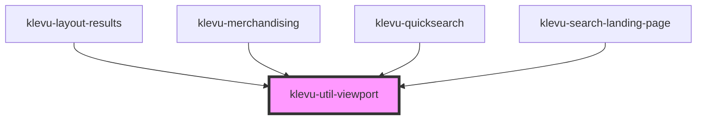

# klevu-util-viewport

<!-- Auto Generated Below -->

## Properties

| Property | Attribute | Description                 | Type             | Default                                                                                                                                                                                                                                                            |
| -------- | --------- | --------------------------- | ---------------- | ------------------------------------------------------------------------------------------------------------------------------------------------------------------------------------------------------------------------------------------------------------------ |
| `sizes`  | --        | List of sizes to listen for | `ViewportSize[]` | `[     { name: "xs", minWidth: 0, maxWidth: 319 },     { name: "sm", minWidth: 320, maxWidth: 511 },     { name: "md", minWidth: 512, maxWidth: 991 },     { name: "lg", minWidth: 992, maxWidth: 1199 },     { name: "xl", minWidth: 1200, maxWidth: 9999 },   ]` |

## Events

| Event              | Description | Type                                                                           |
| ------------------ | ----------- | ------------------------------------------------------------------------------ |
| `klevuSizeChanged` |             | `CustomEvent<{ name: ViewportSizeName; minWidth: number; maxWidth: number; }>` |

## Methods

### `getCurrentSize() => Promise<ViewportSize | undefined>`

#### Returns

Type: `Promise<ViewportSize | undefined>`

## Dependencies

### Used by

 - [klevu-layout-results](../klevu-layout-results)
 - [klevu-merchandising](../klevu-merchandising)
 - [klevu-quicksearch](../klevu-quicksearch)
 - [klevu-search-landing-page](../klevu-search-landing-page)

### Graph

----------------------------------------------

